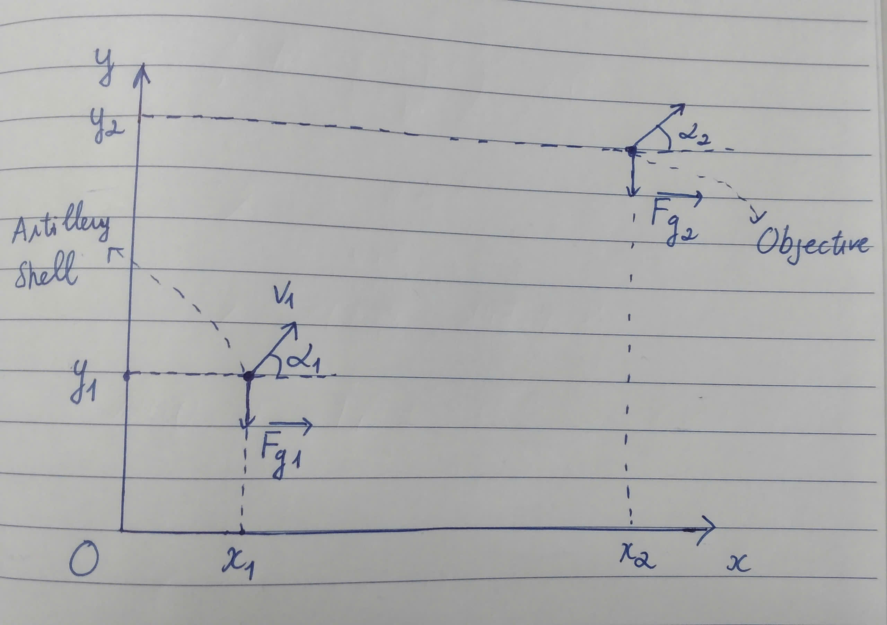
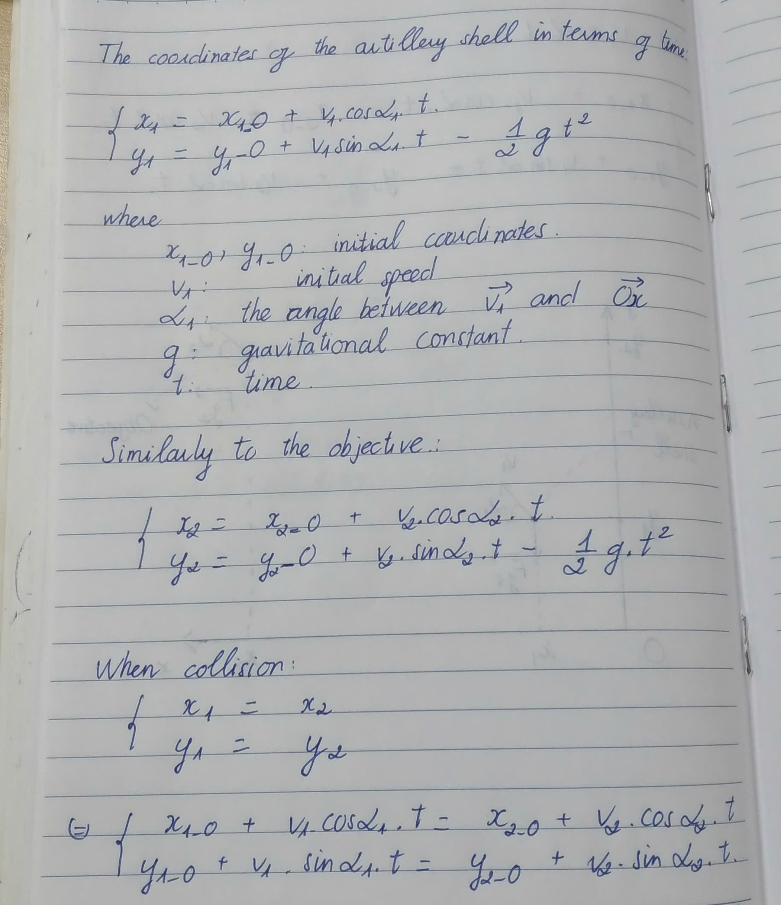
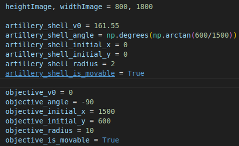

# cs50_final_project
A fun visualization based on Opencv about physical motion

# 1. Description
The system describes the trajectory of an artillery shell and an objective under gravity (without air resistance, friction)

The overview system:

Equations:

# 2. Dependencies
    1. Python 3.9 

    2. Run 'pip install -r requirements.txt'

# 3. Run
    1. Change the parameters at main.py:

    2. Run 'python main.py'