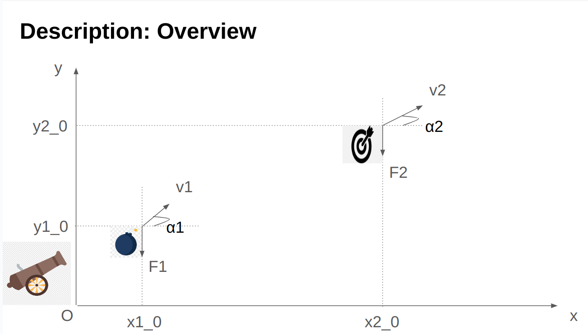
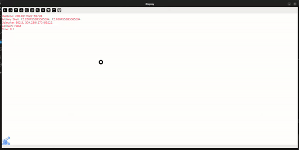

# cs50_final_project
A fun visualization based on Opencv about physical motion

# Video Demo: https://youtu.be/Wcz9SoOLR00

# Description:
The system describes the trajectory of an artillery shell and an objective under gravity (without air resistance, friction). The goal is that find the trajectory of the canon shell so that it can break the objective.

# The overview system:

The system includes two objects. The first one is a canon shell fired from a canon with initial speed v1, initial angle alpha1, initial coordinates x1_0 and y1_0. The second one is an objective with initial speed v2, initial angle alpha2, initial coordinates x2_0 and y2_0

Consequently, we find the coordinate equations of two objects in terms of time. Then, when the collision happens, the coordinates of two objects are equals.

For implement, we model two objects by OOP. Then we use Numpy libraby for efficient coordinates calculation. Finally, we use OpenCV library to visualize the trajectory of two objects. In case of collision, an effect will happen (see at the demo).

# Detailed Equations:

The coordinates of the canon shell in terms of time are given by:
$$x_1 = x_1(t_0) + v_1*cos(\alpha_1)*t$$
$$y_1 = y_1(t_0) + v_1*sin(\alpha_1)*t - 0.5*G*t^2$$
where:
$x_1(t_0), y_1(t_0)$: initial coordinate

$v_1$: initial speed

$\alpha_1$: initial angle between $v_1$ and $Ox$

$G$: gravitational constant

$t$: time

Similarly to the objective:
$$x_2 = x_2(t_0) + v_2*cos(\alpha_2)*t$$
$$y_2 = y_2(t_0) + v_2*sin(\alpha_2)*t - 0.5*G*t^2$$

When collision happens:
$$x_1 = x_2$$ 
$$y_1 = y_2$$
Equivalent to:

$$x_1(t_0) + v_1*cos(\alpha_1)*t = x_2(t_0) + v_2*cos(\alpha_2)*t$$ 
$$y_1(t_0) + v_1*sin(\alpha_1)*t = y_2(t_0) + v_2*sin(\alpha_2)*t$$

# Example:
I choose a set of hyper-parameters
$$\alpha_1 = 45^o, \alpha_1 = 60^o, v_2 = 50 (m/s), x_1(t_0) = y_1(t_0) = 0 (m), x_2(t_0) = 600(m), y_2(t_0) = 500 (m)$$

The solutions of the set of equations are $t = \frac {4}{\sqrt{3} - 1} (s)$ and $v_1 \approx 172.969 (m/s)$

Result: The canon shell could break the objective

# 2. Dependencies
    1. This project uses Python 3.9

    2. Run 'pip install -r requirements.txt' to install dependencies

# 3. Run
    1. Change the parameters at main.py:

    2. Run 'python main.py'

# 4. Future Idea

In the future, I will incorporate incremental learning to the canon shell, so it can find the objective automatically with any initial conditions.

In addition, I will improve the design of two objectives.